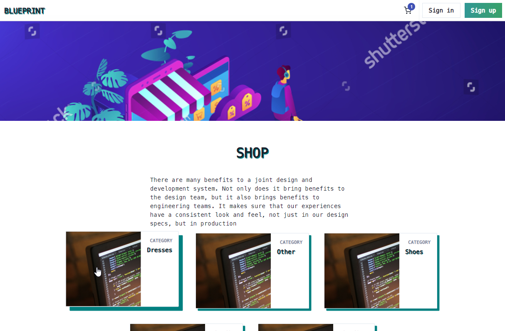
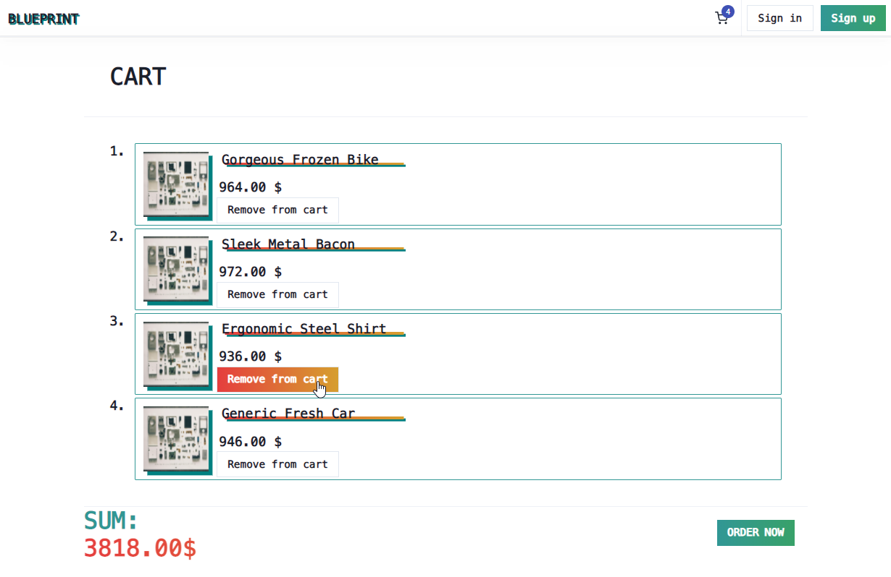
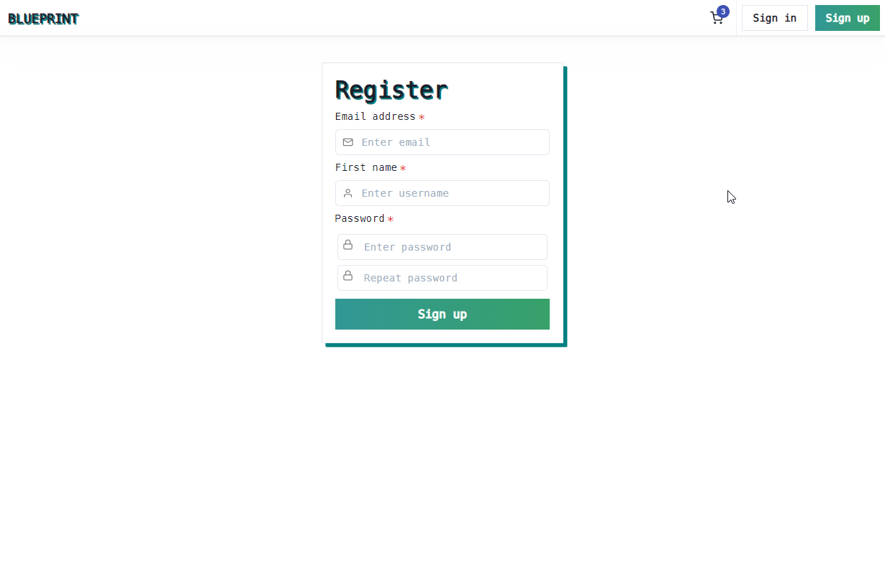
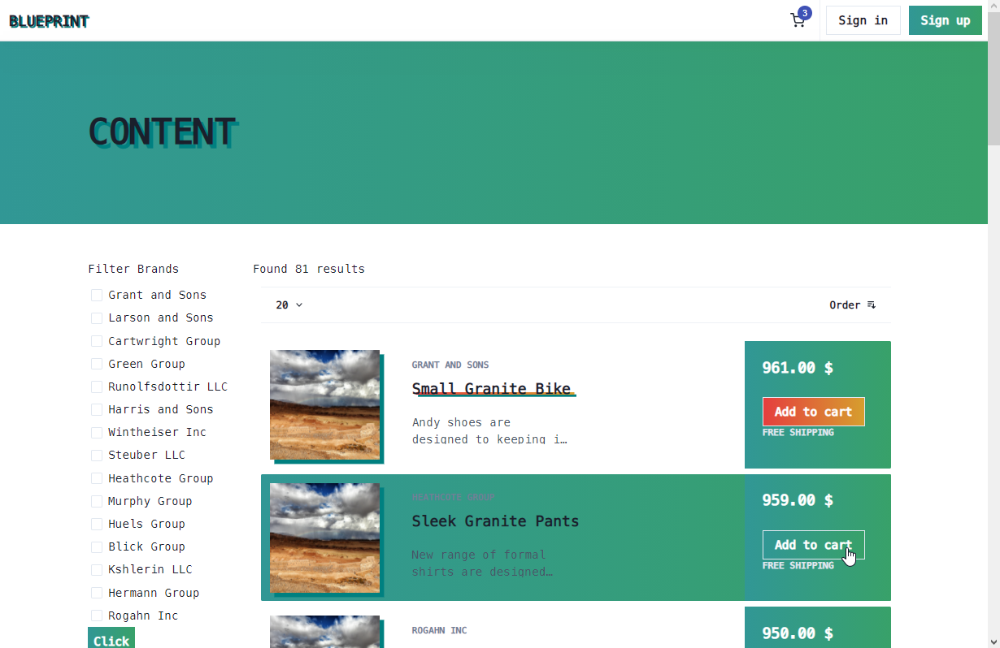

> React.js (Chakra UI) + Redux, server Rust + Actix
# BLUEPRINT
[](https://opensource.org/licenses/MIT)

> **_NOTE:_**  Temporary hosting on AWS with HTTP only (no TLS).

Basic e-commerce with registering system, cart and ordering system. Currently hosted on Amazon Web Services.

## Getting started

- Download repo and `cd e-commerce`
- Build React
```bash
cd frontend
npm install
npm run build
```
- Compile and run server
> NOTE: by default server runs on localhost:4040
```bash
RUST_LOG=info
cd ../backend-rust
cargo build --release
cargo run --release
```

## Screenshots
A few screenshots of app.

> Home Page


> Product page view


> Cart details page


> Register page


> Products list page

